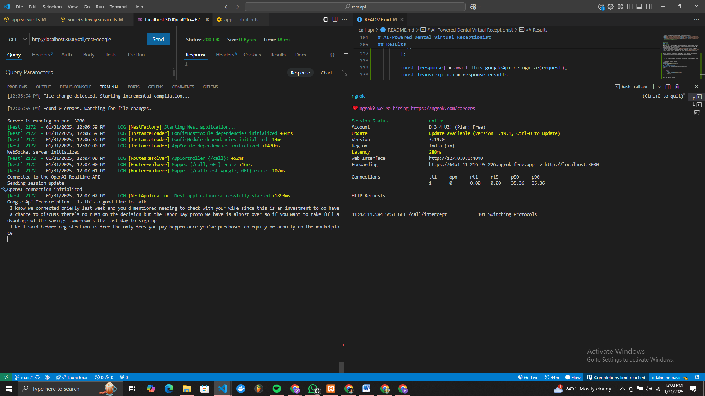
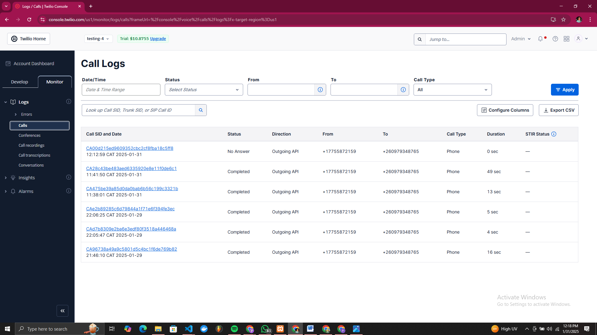

<p align="center">
  <a href="http://nestjs.com/" target="blank"></a>
</p>

[circleci-image]: https://img.shields.io/circleci/build/github/nestjs/nest/master?token=abc123def456
[circleci-url]: https://circleci.com/gh/nestjs/nest

  <p align="center">A progressive <a href="http://nodejs.org" target="_blank">Node.js</a> framework for building efficient and scalable server-side applications.</p>
    <p align="center">
<a href="https://www.npmjs.com/~nestjscore" target="_blank"></a>
<a href="https://www.npmjs.com/~nestjscore" target="_blank"></a>
<a href="https://www.npmjs.com/~nestjscore" target="_blank"></a>
<a href="https://circleci.com/gh/nestjs/nest" target="_blank"></a>
<a href="https://coveralls.io/github/nestjs/nest?branch=master" target="_blank"></a>
<a href="https://discord.gg/G7Qnnhy" target="_blank"></a>
<a href="https://opencollective.com/nest#backer" target="_blank"></a>
<a href="https://opencollective.com/nest#sponsor" target="_blank"></a>
  <a href="https://paypal.me/kamilmysliwiec" target="_blank"></a>
    <a href="https://opencollective.com/nest#sponsor"  target="_blank"></a>
  <a href="https://twitter.com/nestframework" target="_blank"></a>
</p>
  <!--[](https://opencollective.com/nest#backer)
  [](https://opencollective.com/nest#sponsor)-->

## Description

[Nest](https://github.com/nestjs/nest) framework TypeScript starter repository.

## Project setup

```bash
$ npm install
```

## Compile and run the project

```bash
# development
$ npm run start

# watch mode
$ npm run start:dev

# production mode
$ npm run start:prod
```

## Run tests

```bash
# unit tests
$ npm run test

# e2e tests
$ npm run test:e2e

# test coverage
$ npm run test:cov
```

## Deployment

When you're ready to deploy your NestJS application to production, there are some key steps you can take to ensure it runs as efficiently as possible. Check out the [deployment documentation](https://docs.nestjs.com/deployment) for more information.

If you are looking for a cloud-based platform to deploy your NestJS application, check out [Mau](https://mau.nestjs.com), our official platform for deploying NestJS applications on AWS. Mau makes deployment straightforward and fast, requiring just a few simple steps:

```bash
$ npm install -g mau
$ mau deploy
```

With Mau, you can deploy your application in just a few clicks, allowing you to focus on building features rather than managing infrastructure.

## Resources

Check out a few resources that may come in handy when working with NestJS:

- Visit the [NestJS Documentation](https://docs.nestjs.com) to learn more about the framework.
- For questions and support, please visit our [Discord channel](https://discord.gg/G7Qnnhy).
- To dive deeper and get more hands-on experience, check out our official video [courses](https://courses.nestjs.com/).
- Deploy your application to AWS with the help of [NestJS Mau](https://mau.nestjs.com) in just a few clicks.
- Visualize your application graph and interact with the NestJS application in real-time using [NestJS Devtools](https://devtools.nestjs.com).
- Need help with your project (part-time to full-time)? Check out our official [enterprise support](https://enterprise.nestjs.com).
- To stay in the loop and get updates, follow us on [X](https://x.com/nestframework) and [LinkedIn](https://linkedin.com/company/nestjs).
- Looking for a job, or have a job to offer? Check out our official [Jobs board](https://jobs.nestjs.com).

## Support

Nest is an MIT-licensed open source project. It can grow thanks to the sponsors and support by the amazing backers. If you'd like to join them, please [read more here](https://docs.nestjs.com/support).

## Stay in touch

- Author - [Kamil Myśliwiec](https://twitter.com/kammysliwiec)
- Website - [https://nestjs.com](https://nestjs.com/)
- Twitter - [@nestframework](https://twitter.com/nestframework)

## License

Nest is [MIT licensed](https://github.com/nestjs/nest/blob/master/LICENSE).

# AI-Powered Dental Virtual Receptionist

A virtual receptionist system that uses OpenAI's GPT-4, Twilio, and Google Speech-to-Text to handle dental clinic phone calls.

## What I Did

### 1. OpenAI Integration

- Implemented real-time communication with OpenAI's GPT-4 API using WebSocket
- Created a dental receptionist persona with specific guidelines and protocols
- Configured speech-to-text and text-to-speech capabilities using Open AI's response Json and Google-speech-to-text.
- Set up automatic reconnection handling for WebSocket disconnections
  [Open Api Real-time setup](https://platform.openai.com/docs/api-reference/realtime)

### 2. Twilio Integration

- Set up voice call handling using Twilio's programmable voice API
- Implemented media streaming for real-time audio processing
- Created TwiML responses for call flow management
- Configured audio stream interception
  [Twillio Api setup](https://platform.openai.com/docs/api-reference/realtime)

### 3. Google Speech-to-Text Integration

- Implemented call audio transcription using Google's Speech-to-Text API to handle an Audio buffer
- Configured for phone call audio format (MULAW, 8kHz)

## How It Works

1. **Call Initiation**

   - On a get request,a call from registered Twilio phone number, places a phoen call to verified phone numnber,
   - System creates a new call session,
   - A call stream is created and connected to the local websocket server routed through ngrok server,
   - A greeting message is played to the client
   - Initial greeting is played

2. **Real-time Processing**

   ```mermaid
   graph LR
   A[Incoming Call] --> B[Twilio Media Stream]
   B --> C[OpenAI Real-time Processing]
   B --> D[Google Speech-to-Text]
   C --> E[AI Response]
   E --> F[Text-to-Speech]
   F --> G[Audio Response to Caller]
   ```

3. **Audio Processing Flow**
   - Incoming audio is streamed in real-time
   - Dual transcription processing (OpenAI and Google)
   - AI generates contextual responses
   - Responses are converted to speech and played back

## Challenges & Solutions

### 1. WebSocket Connection Stability

**Challenge:** OpenAI WebSocket connections would occasionally drop due to poor network connectivity
**Solution:** Implemented:

- Connection timeout handling
- Automatic reconnection
- Session cleanup

```typescript
private async handleOpenAiDisconnect() {
  console.log('Attempting to reconnect to OpenAI...');
  try {
    await this.initializeOpenAiConnection();
  } catch (error) {
    console.error('Failed to reconnect to OpenAI:', error);
  }
}
```

### 2. Google Transcription limit

**Challenge:** Only the first few bits of the comversation would be transcribed before i hot the request limit on my account.

### 3. Audio Quality and Transcription

**Challenge:** Wrong audio setup affecting transcription accuracy
**Solution:**

- Implemented dual transcription with Google Speech-to-Text
- Used phone_call specific model
- Enhanced audio processing configuration

```typescript
config: {
  encoding: 'MULAW',
  sampleRateHertz: 8000,
  languageCode: 'en-US',
  model: 'phone_call',
  useEnhanced: true,
}
```

[Google CLoude Api reference](https://cloud.google.com/speech-to-text/docs/phone-model)

### 4. Twillio inability to add multiple verified numbers

**challenges** Had to create multiple accounts to use different numbers that can be called

## Results

**twillio call and stream initiation**

```typescript
  async initiateCall(to: string) {
    try {
      const response = new VoiceResponse();
      const initialGreeting = 'Welcome, how may I help you today?';
      response.say(initialGreeting);
      const call = await this.client.calls.create({
        to,
        from: this.configService.get('twilio.phoneNumber'),
        twiml: `
          <Response>
            <Say>${initialGreeting}</Say>
            <Connect>
              <Stream name="Outbound Audio Stream" track="inbound_track" url="wss://[ngrok-forwarding-url]/call/intercept">
               <Parameter name="track" value="both" />
              </Stream>
            </Connect>
          </Response>
        `,
        record: true,
      });

      this.activeCalls.set(call.sid, {
        callSid: call.sid,
        from: this.configService.get('twilio.phoneNumber'),
        to,
        status: 'initiated',
        initialGreeting,
      });
      console.log('Stream connected');
      return {
        success: true,
        call_id: call.sid,
      };
    } catch (error) {
      console.error('Error initiating call:', error);
      return {
        success: false,
        error: error.message,
      };
    }
  }
```

**google Api transaction**

```typescript
  async testGoogleApi() {
    readFile('src/audiotest.mp3', async (err, audioBuffer) => {
      this.audioBuffer = audioBuffer;
      if (err) {
        console.error('Error reading the audio file:', err);
        return;
      }
      try {
        const request = {
          config: {
            encoding: 'MP3',
            sampleRateHertz: 16000,
            languageCode: 'en-US',
            audioChannelCount: 1,
            useEnhanced: true,
          },
          audio: {
            content: audioBuffer.toString('base64'),
          },
        };

        const [response] = await this.googleApi.recognize(request);
        const transcription = response.results
          .map((result) => result.alternatives[0].transcript)
          .join('\n');
        console.log('Google Api Transcription...' + transcription);
      } catch (error) {
        console.log('error transcribing', error);
      }
    });
  }
```





## Environment Setup

Required environment variables:

```
TWILIO_ACCOUNT_SID=your_account_sid
TWILIO_AUTH_TOKEN=your_auth_token
TWILIO_PHONE_NUMBER=your_phone_number
OPENAI_API_KEY=your_openai_key
```

[Google Cloud Authentication for APi using CLI ->](https://cloud.google.com/speech-to-text/docs/speech-to-text-client-libraries)

## Contributor

[David Utibe_abasi Okuku] - Initial work
